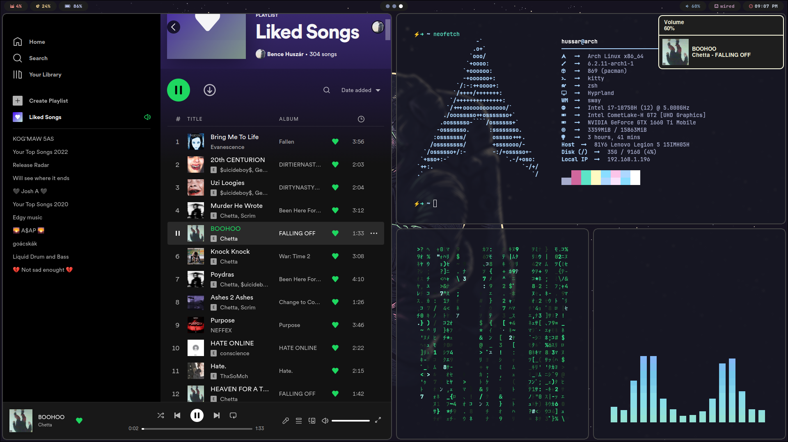
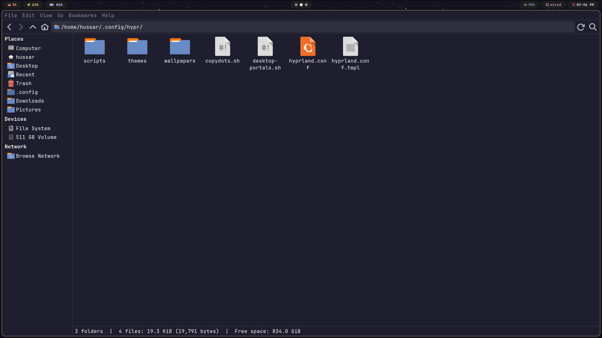
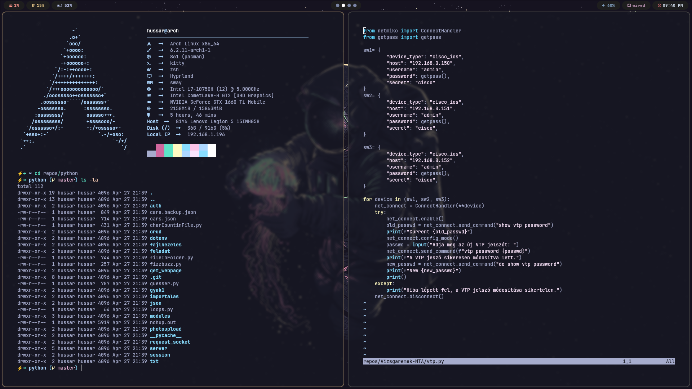
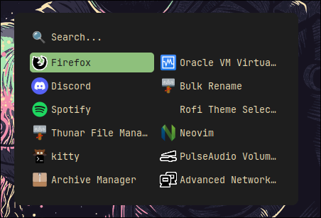
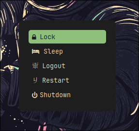
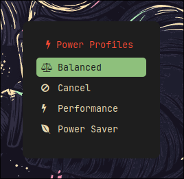

# Hyprland dotfiles [old]
These config are for hyprland on arch linux

## Screenshots








## Details
* Compositor - [hyprland](https://hyprland.org/)
* Shell - [zsh (zap)](https://www.zapzsh.org/)
* Terminal - [kitty](https://sw.kovidgoyal.net/kitty/)
* Bar - [waybar](https://github.com/Alexays/Waybar)
* Launcher/Emojis - [rofi](https://github.com/davatorium/rofi) 
* Text Editor/IDE - [neovim](https://neovim.io/)
* File Manager - [thunar](https://docs.xfce.org/xfce/thunar/start)
* Audio Visualizer - [cava](https://github.com/karlstav/cava)
* Resource Monitor - [btop](https://github.com/aristocratos/btop)

## Dependencies
```
yay -S hyprland-git xdg-desktop-portal-hyprland-git grim cava slurp socat swappy cliphist swaylock-effects-git wofi swaync jq eww-wayland swww-git zathura-pdf-mupdf zathura lf neofetch kitty-git btop dictd moreutils pamixer wf-recorder unimatrix-git playerctl pistol-git ttf-material-design-icons-desktop-git pacman-contrib checkupdates+aur neo-matrix waybar rofi-git thunar-git
```
